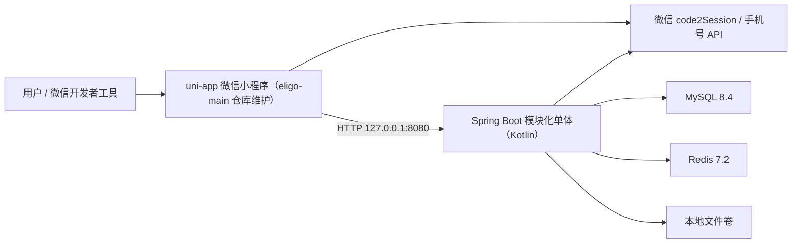
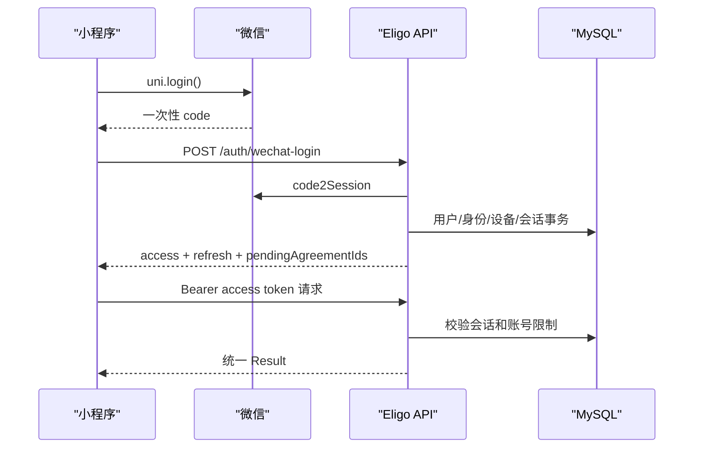

# 技术栈与系统架构

> 文档版本：1.0
> 事实来源：`build.gradle.kts`、`settings.gradle.kts`、Spring 配置、Compose、源码目录和本地核对结果。
> 当前形态：单仓库、模块化单体、本地 Docker 依赖、仅后端（eligo-new 是 eligo-main 的 Kotlin 重写版本，不包含前端）。

## 1. 架构结论

当前选择总体合理：两名主要开发者和 MVP 阶段使用模块化单体，可以共享事务、减少部署单元并保持交付速度。真正的问题不是“没有微服务”，而是原有后端按技术层/功能包自然增长、接口状态缺少统一台账。解决方向是：

- 保持一个 Spring Boot 部署单元；
- 按领域包划分模块，约束跨模块访问；
- OpenAPI 作为机器可读契约（沿用 eligo-main 的 65 条路径、80 个 HTTP 操作）；
- 同仓库维护后端、基础设施和联调证据；
- 只有在团队、负载或独立发布需求真实出现时再拆服务。

不建议现在拆微服务。活动、报名、通知和关注流存在一致性与联动，拆分会立即引入分布式事务、消息可靠性、链路追踪和多环境发布成本。

## 2. 运行拓扑



eligo-new 只包含后端，前端仍由 eligo-main 仓库的 `eligo-frontend` 维护。当前本地开发没有 Nginx。API、MySQL 和 Redis 只绑定 `127.0.0.1`。真机或共享测试环境需要 HTTPS 域名和网关，但不是本机首轮接口开发的前置条件。

## 3. 固定技术版本

### 后端

| 组件 | 当前版本/配置 | 作用 | 事实位置 |
| --- | --- | --- | --- |
| Kotlin | 2.1.21，JVM 目标 17，apiVersion/languageVersion `KOTLIN_2_1` | 编译与运行 | `eligo-new/build.gradle.kts` |
| 构建工具 | Gradle（Kotlin DSL），通过 Gradle Wrapper 统一版本 | 依赖管理与打包 | `build.gradle.kts`、`gradle/wrapper/` |
| Spring Boot | 4.1.0 | Web、配置、Actuator | `build.gradle.kts` |
| Spring Security | 随 Boot 4.1，OAuth2 Resource Server + JOSE | JWT Resource Server、方法安全 | `SecurityConfig.kt`、`build.gradle.kts` |
| MyBatis-Plus | 3.5.16（`mybatis-plus-spring-boot4-starter`） | Mapper 与持久化 | `build.gradle.kts` |
| MySQL | 8.4.10，`mysql-connector-j`（runtime） | 主业务存储 | `infra/docker/compose.yaml` |
| Redis | 7.2.14-alpine | 微信 access token 等短期状态 | `compose.yaml` |
| Flyway | 随 Boot 4.1，`flyway-mysql` | 版本化迁移 | `db/migration/` |
| Jackson | `jackson-module-kotlin`（Boot 自动配置） | Kotlin JSON 序列化 | `build.gradle.kts` |
| Kotlin Reflect | `kotlin-reflect` | 反射支持 | `build.gradle.kts` |
| JWT | HS256（Nimbus JOSE `MACSigner`）；access 15 分钟、refresh 30 天 | 无状态访问令牌 + 有状态会话 | `application.properties`、`JwtTokenService.kt` |
| 文件 | 本地 `LocalFileStorage` 实现 | 当前头像和导出文件 | `file/storage/` |

测试依赖：`spring-security-test`、`spring-boot-starter-data-redis-test`、`spring-boot-starter-validation-test`、`spring-boot-starter-webmvc-test`、`kotlin-test`、`kotlin-test-junit5`、`mockito-kotlin` 5.4.0。Gradle Wrapper 要求 Gradle 8.x 及以上。Docker 构建阶段和运行阶段均使用 Temurin 17，运行容器使用非 root 用户。

### 前端

eligo-new 不包含前端。前端技术栈与版本仍以 eligo-main 仓库 `eligo-frontend/package.json` 为准。

## 4. 后端模块结构

源码根目录为 `src/main/kotlin/com/eligo/server/`，使用按领域顶层包：

```text
com.eligo.server/
├── common/                 统一响应、错误、追踪
├── config/                 Spring 与安全配置（含 security/JwtProperties）
├── security/               JWT、会话、账号限制、敏感数据编解码
├── integration/wechat/     微信外部接口适配器
├── account/                账号、身份、会话、手机号、注销、导出
├── agreement/              协议版本和同意记录
├── profile/                资料、兴趣、行政区划
├── organization/           组织、成员与角色
├── activity/               活动与发布生命周期
├── participation/          报名、取消、名额
├── follow/                 用户/组织关注关系
├── post/                   动态及图片引用
├── comment/                活动评论
├── favorite/               活动收藏
├── recommendation/         推荐索引与推荐流
└── file/                   文件元数据、存储、检查和清理
```

各领域包内部统一使用 `controller`、`service`、`mapper`、`entity`、`dto`、`vo`、`error` 子包组织。`follow`、`post`、`recommendation` 属于同一交付模块 M4，但代码职责分开。支付未来使用独立 `payment` 边界，当前不得把支付字段塞进 `participation`。

## 5. 分层职责

当前代码以 Controller、Service、Mapper、Entity、DTO/VO 为主，属于轻量应用分层，并非完整 DDD。目标边界：

```text
HTTP Controller
  → Application/Domain Service
    → 本模块 Mapper/Repository
      → MySQL

Service
  → integration/wechat 或 Storage 接口
    → 外部系统
```

| 层 | 允许 | 禁止 |
| --- | --- | --- |
| Controller | 参数绑定、Bean Validation、Principal、HTTP 状态 | 状态机、跨表事务、拼 SQL |
| Service | 用例编排、事务、权限、状态转换、领域校验 | 返回 Servlet 类型、依赖前端页面 |
| Entity/领域对象 | 状态和持久化字段 | 直接调用外部 HTTP |
| Mapper/Repository | 本模块数据查询与持久化 | 替别的模块做业务决策 |
| Integration | 微信、对象存储、内容安全适配 | 主导数据库事务 |

Kotlin 约定：领域对象优先使用 `data class` 表达不可变值与持久化字段；Service 接口与默认实现以 `Default*Service` 命名（如 `DefaultAuthService`、`DefaultActivityCommandService`）；配置属性使用 `@ConfigurationProperties` 绑定的 `data class`（如 `JwtProperties`）。当前已有一些跨层耦合属于演进中的技术债；新增模块必须遵循上表，不必为了形式一次性重写已交付部分。

## 6. 核心请求链

### 登录与会话



access token 不是唯一会话事实。每次受保护请求还经过 `SessionAuthenticationFilter` 和 `AccountRestrictionFilter`，用于处理退出、踢出、注销限制等服务端状态。

### 当前 M2/M3 后端活动链

```text
游客浏览公开活动
  → 微信登录并完善认证个人所需资料（当前无正式协议）
  → 以个人身份创建草稿
     或以后端预置的唯一企业身份创建企业草稿
  → 服务端鉴权和字段校验
  → 本地直接发布
  → 活动公开
  → 用户免费报名并直接 ACTIVE
  → 本人可在活动开始前取消并重新报名
     或发起者移除参与者且该用户不能再次报名
  → 发起者取消活动并终止 ACTIVE 参与关系
     或活动正常结束并保留 ACTIVE 参与历史
```

上述后端闭环已实现，前端页面接入和 IT-002 端到端联调尚未完成。动态、关注流和推荐（M4）已实现，活动变更通知属于后续 M5。

## 7. 数据与一致性

- MySQL 是账号、业务关系和审计记录的最终事实来源。
- Redis 只保存可重建或有明确过期的状态，不作为活动名额和支付结果的最终事实。
- 当前迁移到 V18：V1 至 V4 建立 M1 与企业基础，V5 至 V9 建立活动、媒体、生命周期、幂等和查询索引，V10 建立活动参与关系，V11 活动地点坐标，V12 活动联系方式与性别，V13 关注与动态，V14 推荐索引任务，V15 活动集合地点名称，V16 活动话题，V17 活动收藏，V18 活动评论。迁移脚本与 Java 版本共用同一份 schema 事实。
- 业务 ID 在数据库使用 `BIGINT`，API 转为字符串。
- 数据库、Kotlin 时间和容器 API 统一使用 UTC；前端按用户时区展示。
- 报名名额、关注唯一性、协议同意等必须由数据库唯一约束/锁和事务共同保护。

## 8. 架构健康度

| 维度 | 评价 | 原因与动作 |
| --- | --- | --- |
| 部署形态 | 合理 | 当前团队不需要微服务；保持模块化单体 |
| 领域划分 | 边界已建立 | M0 至 M4.1 按领域包组织；持久化边界由 `ModuleBoundaryTest` 保护，跨模块通过应用服务/访问服务协作 |
| 接口契约 | 基础已补齐 | 沿用 eligo-main 的 OpenAPI 与契约测试（`OpenApiContractTest`）；必须持续维护状态台账 |
| 重写状态 | 与 Java 版对齐 | Kotlin 重写保持相同业务领域与 65 条路径、80 个 HTTP 操作；713 个测试，0 失败，129 跳过 |
| 数据演进 | 有保护 | Flyway 默认关闭、Docker 显式开启；当前任务分支前进至 V18；M2 活动地点使用 V11，M3 联系方式使用 V12，M4 关注动态使用 V13，M4.1 推荐任务使用 V14，M2 地点名称 V15，M2 话题 V16，M3 收藏 V17，M3 评论 V18 |
| 权限 | M2/M3/M4 后端已实现 | capability、组织资源级鉴权、公开活动 DTO、参与权限与 M4 关注/动态能力已实现；管理员 UI 与 M5 权限仍待后续模块 |
| 文件存储 | 本地可用、生产不足 | 本地卷适合开发；共享/生产前接对象存储 |
| 可观测性 | 最低可用 | requestId、health、metrics 已有；暂无集中日志和告警 |
| 测试 | 后端较强、前端缺失 | 后端 713 个测试，覆盖 M0 至 M4.1；前端尚无自动测试 |

## 9. 何时才考虑拆服务

至少满足以下两个条件再评估：

- 某模块需要独立扩缩容或发布频率显著不同；
- 模块有独立团队和清晰数据所有权；
- 单体部署时间或故障域已造成实际损失；
- 已建立可靠消息、分布式追踪、配置和发布平台；
- 拆分收益可量化，高于分布式一致性成本。

支付接入也不自动等于微服务；可以先在单体内保持独立模块和表，再依据合规与可用性要求决定是否物理拆分。
